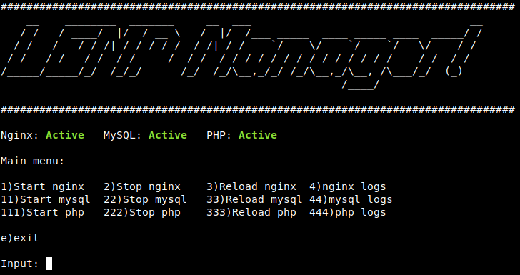

I use the subprocess module to manipulate statuses of services in LEMP Stack, that is Nginx, MariaDB (or maybe MySQL Server) and PHP (php-fpm), give it some nice terminal colors with third-party library: termcolor, ASCII welcoming text generator with pyfiglet, and then a loading animation with Halo.

The settings for LEMP Manager is stored as list in `config.py`

Here is the links of libraries I use:
[pyfiglet](https://pypi.org/project/pyfiglet/0.7/)
[Halo](https://pypi.org/project/halo/)
[termcolor](https://pypi.org/project/termcolor/)

You can look at it more at the [repo](https://github.com/sayyidyofa/lemp-manager-py).

