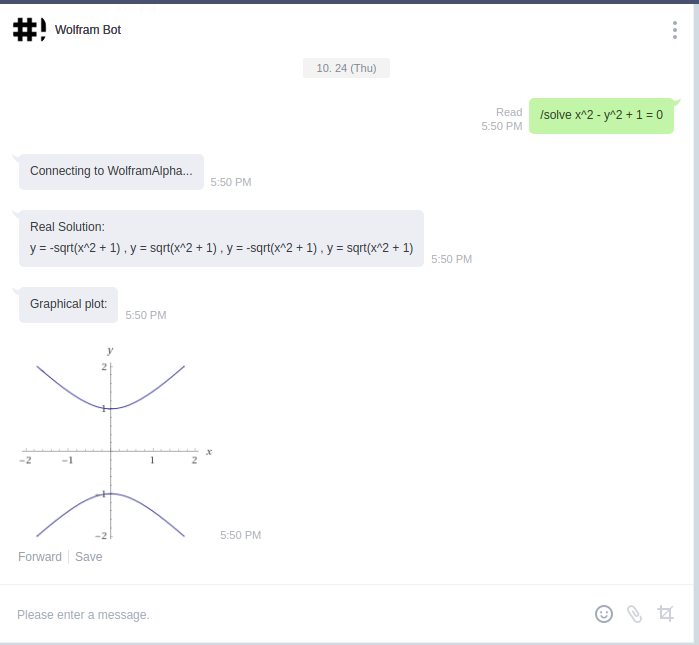

This bot is a team college project for Software Engineering course, it is also my first attempt to learn about Continous Integration and Continous Deployment and API wrapping.

Currently this bot has only one function: `/solve`. This command takes one argument that is a mathematical expression of quadratic equation. For example `/solve x^2 - y^2 + 1 = 0`. After a command is fired a request is sent to Wolfram Alpha API with a response of huge JSON containing detailed answer of question provided such as real solution, graphical plot, etc. Currently the bot will respond with 'real solution' and 'grapichal plot' for each question.

This bot uses free Wolfram APPID so it can't fire more than 2000 API requests per month.

This bot is implemented using Flask.
 
Source: <a href="https://github.com/sayyidyofa/WolframBot"><i class="large github icon"></i>"</a>
